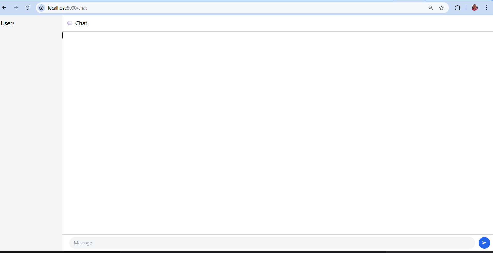
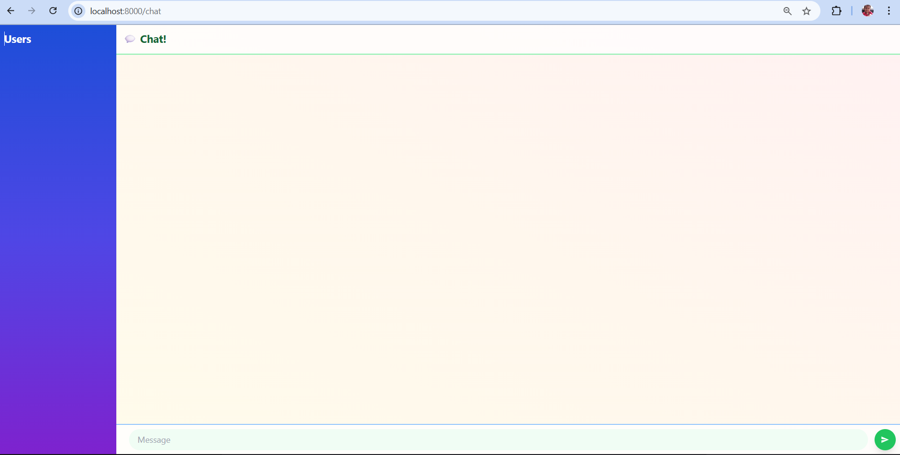

# YewChat 💬

> Source code for [Let’s Build a Websocket Chat Project With Rust and Yew 0.19 🦀](https://fsjohnny.medium.com/lets-build-a-websockets-project-with-rust-and-yew-0-19-60720367399f)

## Install

1. Install the required toolchain dependencies:
   ```npm i```

2. Follow the YewChat post!

## Branches

This repository is divided to branches that correspond to the blog post sections:

* main - The starter code.
* routing - The code at the end of the Routing section.
* components-part1 - The code at the end of the Components-Phase 1 section.
* websockets - The code at the end of the Hello Websockets! section.
* components-part2 - The code at the end of the Components-Phase 2 section.
* websockets-part2 - The code at the end of the WebSockets-Phase 2 section.


Experiment 3.1: Original code




Experiment 3.2: Be Creative!


The chat interface is designed using a horizontal flex layout. On the side, there's a colorful gradient sidebar displaying each user in a semi-transparent card, complete with rounded avatars and a hover animation. The main chat section includes a see-through header labeled “Chat!”, sitting above a scrollable message area. Messages appear as white, rounded cards featuring avatars with blue borders, sender names in bold blue, and gray message text—with any gif links shown directly as images. At the bottom, a semi-transparent footer contains a rounded green input box that highlights on focus, next to a circular green send button with a paper-plane icon that darkens when hovered over.